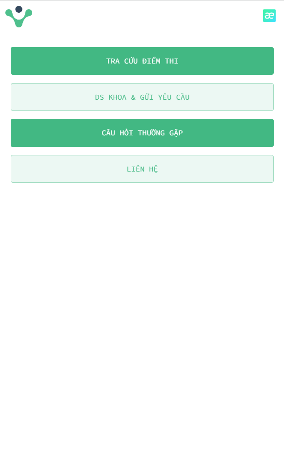

# SGU Rank Frontend 2022

## Demo

Now the app is started at 

Official url: https://www.ram4gb.site/#/

Backup url: https://sgu-rank-fe.vercel.app/#/

  

## Requirement
<pre>
node -v

v14
</pre>

## Install packages

<pre>
npm i
</pre>

## Start dev code

<pre>
npm run dev
</pre>

## Build code

<pre>
npm run build
</pre>

## Deploy

After you run ``npm run build``, webpack will create ``dist`` folder. If you are running server hosting, put every file from dist into the public_html. Otherwise, you are running on local, you just need to ``npm run serve ``

## Analyzic

- Manage all tag and debug if analyzic tag is working correctly. We use g4 to track person's behavior such as: scroll, view, click,... [[Tag management](https://tagmanager.google.com/#/home) ]
- This is a place where we generate a measure code id & stream id to add it into the tag management. [[ID Analyzic](https://analytics.google.com/analytics/web/?authuser=0&hl=en#/a160915242p322440600/admin/streams/table/3843323327)]

> [Hint]: Please turn off fireware extension before checking the analyses

## Related post

Old version of this project, you can find out in [https://github.com/Ram4GB/fs-search-rank-k17-sguni]

## A number of read/write data in one day (Firebase)

## A number of read/write data in one hour (Firebase)

## Contributors

- Huy Nguyen [https://github.com/tortoise10h]
- Bao Minh [https://github.com/minhminion]
- Dinh Thien [https://github.com/truongdinhthien]
